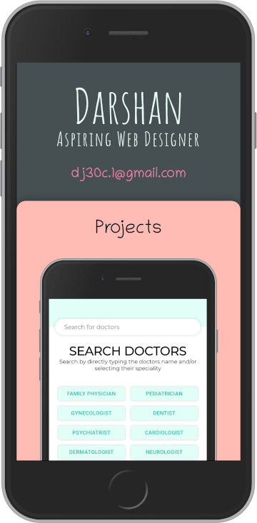

# README Template

> My portfolio with simple and clean design.

[//]: # (Screenshot, Application concept art etc)


[//]: # (Live Demo link)
<p align="center">
  <a href="https://darshanjayadev.netlify.com/">Live Demo</a>
</p>

## Built With

* HTML
* CSS
* React
* Inkscape
* [Figma](https://www.figma.com/file/EugmXUkMVSBC4JCLrvJ8u5/Portfolio?node-id=0%3A1)

## Get Started

### Setup

1. Clone this repository.

```bash
git clone git@github.com:juzQrios/portfolio.git
```

2. Install dependencies.

```bash
yarn install
```

3. Start the local server.

```bash
yarn start
```

4. Open <http://localhost:3000/> in a browser.

### Tests

While it is a good practice to test code, this project doesn't have any tests right now but I might add them in future.

### Deployment

You can easily deploy this React application using one of the several methods to [Netlify](https://www.netlify.com).

Easiest method being to deploy it from Git by clicking on the "[New site from Git](https://app.netlify.com/start)" button on Netlify dashboard.

## Contributing

Contributions, issues and feature requests are welcome!

Feel free to checkout this project's [Kanban board](https://github.com/juzQrios/portfolio/projects/1) or [issues page](https://github.com/juzQrios/portfolio/issues).

## Acknowledgments

* [Create React App](https://github.com/facebook/create-react-app)
* [Coolors.co](https://coolors.co/)
* [Adobe Color](https://color.adobe.com/create)

## License

This project is [MIT](./LICENSE) licensed.

## Authors

#### Darshan

* GitHub: [@juzQrios](https://github.com/juzQrios)
* Linkedin: [Darshan J](https://www.linkedin.com/in/jayadevdarshan/)
* Email: <jayadev.darshan@gmail.com>
