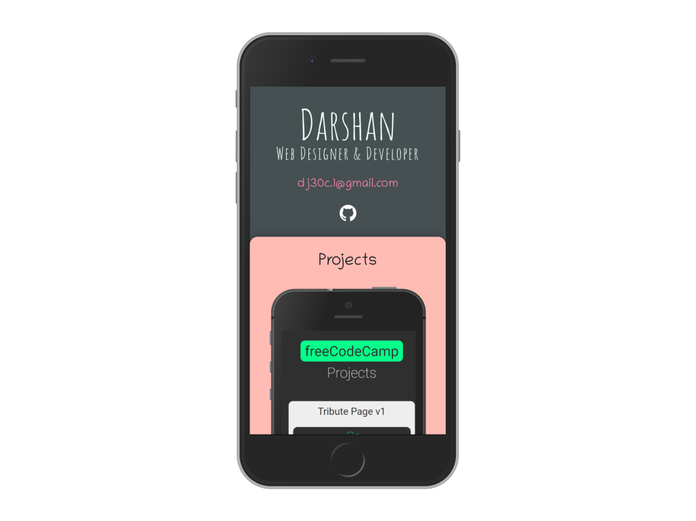

# Portfolio

My personal portfolio with simple and clean design.

This project was bootstrapped with [Create React App](https://github.com/facebook/create-react-app).



[Live link](https://darshanjayadev.netlify.com/)

## Get Started

Clone this repository to your work environment:

```bash
git clone git@github.com:juzQrios/portfolio.git
```

Open the project in the editor of your choice:

```bash
cd portfolio
```

Install dependencies:

```bash
yarn install
````

Start the dev server:

```bash
yarn start
```
